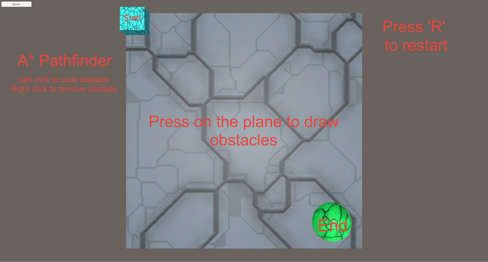

# vr-astar-pathfinder
Application that works both in VR and without it that contains a surface on which enemies can be spawned and walk on.
By using the HTC Vive controller, a new obstacle is placed on the place the laser pointer points when the trigger is pressed.
Alternativiley, the mouse can be used to build obstacles (Left click) and destroy obstacles (Right click).
The button on the top left releases one agent to reach its path.
The agents travel from the start to the end by calculating the shortest path with the A* algorithm.

## A* Pathfinder

  * Contains whole project (Assets, Builds for VR and NON-VR, Pictures of the game).
  * Works with live addition of obstacles, agent recalculates route each time an obstacle is placed.
  * If no route to the goal exist then a new UI text appears and either the scene must be reset or the obstacle covering the way must be removed.
